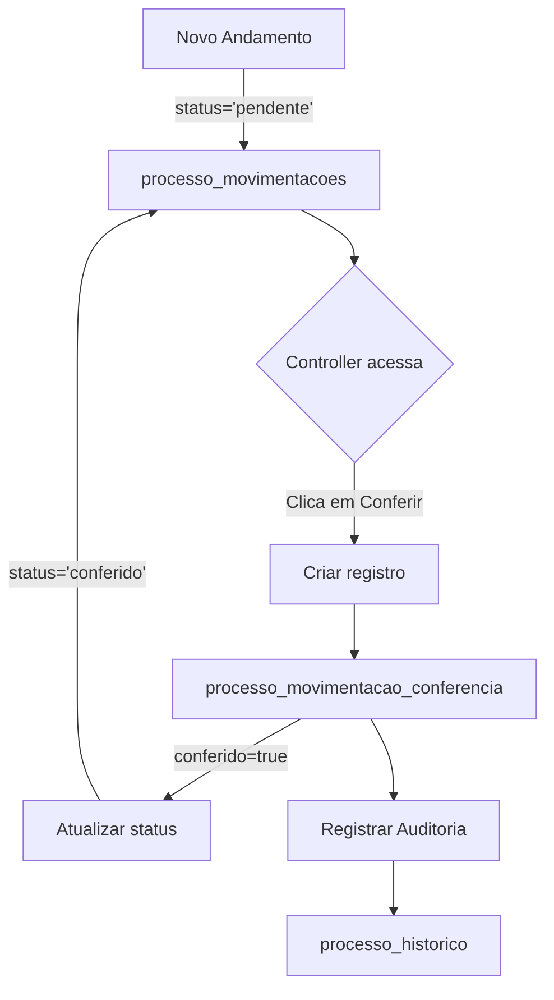

# ✅ Implementação Completa - Fases 1, 2 e 3

## 📋 Resumo da Implementação

Foram implementadas com sucesso as **Fases 1, 2 e 3** da reestruturação da seção Controladoria:

### ✅ Fase 1: Modificações no Cadastro de Processos

**Objetivo:** Permitir entrada manual e flexível de dados

**Alterações no Banco de Dados:**
- ✅ Adicionadas colunas `tribunal_nome`, `comarca_nome` e `tipo_acao_nome` à tabela `processos`
- ✅ Colunas de referência (`tribunal_id`, `comarca_id`, `tipo_acao_id`) mantidas para compatibilidade

**Modificações no Código:**
- ✅ `src/lib/validations/processo.ts` - Atualizado schema de validação para suportar campos de texto livre
- ✅ `src/components/Controladoria/GrupoAcaoCombobox.tsx` - **NOVO** componente combobox com funcionalidade "Adicionar novo"
- ✅ `src/components/Controladoria/ProcessoForm.tsx` - Substituídos seletores por inputs de texto livre:
  - Tribunal: Input de texto livre
  - Comarca: Input de texto livre
  - Grupo de Ação: Combobox com opção de criar novos grupos
  - Tipo de Ação: Input de texto livre
- ✅ `src/pages/ControladoriaProcessoDetalhes.tsx` - Atualizado para exibir os novos campos de texto

**Como usar:**
1. Acesse "Controladoria" > "Novo Processo"
2. Digite manualmente:
   - **Tribunal:** Ex: "TJSP", "TJRJ", "TRT 2ª Região"
   - **Comarca:** Ex: "São Paulo - Capital", "Rio de Janeiro"
   - **Grupo de Ação:** Selecione existente ou crie novo clicando em "Criar novo"
   - **Tipo de Ação:** Ex: "Ação de Cobrança", "Ação de Despejo"

---

### ✅ Fase 2: Criação do Perfil "Controller"

**Objetivo:** Criar novo perfil de usuário responsável pela controladoria

**Alterações no Banco de Dados:**
- ✅ Adicionado role `'controller'` ao enum `app_role`

**Novos Componentes:**
- ✅ `src/components/Admin/RoleManagement.tsx` - **NOVO** Gerenciamento visual de roles
  - Lista todos os usuários do sistema
  - Permite adicionar/remover roles de cada usuário
  - Interface visual com badges coloridos
  - Validação para não remover a última role de um usuário
- ✅ `src/pages/AdminRoles.tsx` - **NOVA** Página dedicada para gerenciamento de permissões

**Como usar:**
1. Acesse o menu Admin (apenas para usuários admin)
2. Vá para "Gerenciamento de Permissões"
3. Selecione um usuário
4. No dropdown "Adicionar role", escolha "Controller"
5. A role será adicionada ao usuário
6. Para remover, clique no badge da role com o "×"

**Roles Disponíveis:**
- 🔴 **Admin:** Acesso completo
- 🟦 **Controller:** Controladoria e conferência de andamentos
- ⚪ **Advogado:** Gestão de processos
- ⚪ **Comercial:** CRM e clientes
- ⚪ **Financeiro:** Gestão financeira

---

### ✅ Fase 3: Sistema de Conferência de Andamentos

**Objetivo:** Criar sistema de controle e conferência de andamentos processuais

**Alterações no Banco de Dados:**
- ✅ Adicionada coluna `status_conferencia` à tabela `processo_movimentacoes`
  - Valores: `'pendente'`, `'conferido'`, `'em_revisao'`
  - Padrão: `'pendente'`
- ✅ Criada tabela `processo_movimentacao_conferencia`:
  ```sql
  - id: UUID (PK)
  - movimentacao_id: UUID (FK -> processo_movimentacoes)
  - conferido: BOOLEAN
  - conferido_por: UUID (FK -> auth.users)
  - conferido_em: TIMESTAMP
  - observacoes_conferencia: TEXT
  - created_at, updated_at: TIMESTAMP
  ```
- ✅ Índices criados para performance:
  - `idx_processo_movimentacoes_status_conferencia`
  - `idx_processo_movimentacao_conferencia_movimentacao`
  - `idx_processo_movimentacao_conferencia_conferido_por`

**Políticas RLS (Row Level Security):**
- ✅ Controllers e Admins podem gerenciar todas as conferências
- ✅ Usuários podem visualizar conferências dos seus próprios processos
- ✅ Sistema de auditoria automático registra todas as conferências no histórico do processo

**Triggers Automáticos:**
- ✅ `update_processo_movimentacao_conferencia_updated_at()` - Atualiza timestamp
- ✅ `registrar_conferencia_audit_insert()` - Registra auditoria ao criar conferência
- ✅ `registrar_conferencia_audit_update()` - Registra auditoria ao atualizar conferência

**Novos Tipos TypeScript:**
- ✅ `src/types/movimentacao.ts` - **NOVO** arquivo com tipos:
  - `StatusConferencia`
  - `ProcessoMovimentacao`
  - `ConferenciaMovimentacao`
  - `MovimentacaoComConferencia`

**Segurança:**
- ✅ Apenas usuários com role `controller` ou `admin` podem gerenciar conferências
- ✅ Todas as ações são registradas no `processo_historico` para auditoria
- ✅ RLS policies garantem que usuários só vejam conferências dos seus processos

---

## 🗂️ Arquivos Modificados

### Novos Arquivos Criados:
1. ✅ `src/types/movimentacao.ts`
2. ✅ `src/components/Admin/RoleManagement.tsx`
3. ✅ `src/components/Controladoria/GrupoAcaoCombobox.tsx`
4. ✅ `src/pages/AdminRoles.tsx`

### Arquivos Modificados:
1. ✅ `src/lib/validations/processo.ts`
2. ✅ `src/components/Controladoria/ProcessoForm.tsx`
3. ✅ `src/pages/ControladoriaProcessoDetalhes.tsx`

### Migrations SQL:
1. ✅ Migration 1: Adicionar campos de texto livre + role controller
2. ✅ Migration 2: Sistema de conferência de andamentos + triggers + RLS

---

## 🔄 Próximos Passos (Fases 4 e 5)

### Fase 4: Botão "Atualizar Andamentos"
- [ ] Criar Edge Function para buscar andamentos
- [ ] Componente `AtualizadorAndamentos.tsx` com botão e loading
- [ ] Integração com API externa (PJE ou similar)

### Fase 5: Interface de Conferência
- [ ] Atualizar aba "Movimentações" em `ControladoriaProcessoDetalhes.tsx`
- [ ] Criar componente `MovimentacaoCard.tsx` para exibir andamentos
- [ ] Implementar botões de ação (Conferir, Em Revisão)
- [ ] Campo de observações para cada conferência

---

## 📊 Estrutura de Dados

### Fluxo de Conferência:



### Exemplo de Uso:

```typescript
// Buscar movimentações com conferências
const { data } = await supabase
  .from('processo_movimentacoes')
  .select(`
    *,
    processo_movimentacao_conferencia(
      *,
      usuario:profiles(full_name, email)
    )
  `)
  .eq('processo_id', processoId)
  .order('data_movimentacao', { ascending: false });

// Marcar como conferido
await supabase
  .from('processo_movimentacao_conferencia')
  .insert({
    movimentacao_id: movimentacaoId,
    conferido: true,
    conferido_por: userId,
    conferido_em: new Date().toISOString(),
    observacoes_conferencia: 'Prazo registrado na agenda'
  });
```

---

## 🎯 Status da Implementação

| Fase | Status | Progresso |
|------|--------|-----------|
| Fase 1: Cadastro Flexível | ✅ Completo | 100% |
| Fase 2: Perfil Controller | ✅ Completo | 100% |
| Fase 3: Sistema de Conferência | ✅ Completo | 100% |
| Fase 4: Atualizar Andamentos | ⏳ Pendente | 0% |
| Fase 5: Interface de Conferência | ⏳ Pendente | 0% |

---

## 🔐 Segurança Implementada

- ✅ RLS policies para controle de acesso
- ✅ Security definer functions para verificação de roles
- ✅ Auditoria automática de todas as conferências
- ✅ Validação de permissões no backend e frontend
- ✅ Índices para performance de queries
- ✅ Unique constraints para prevenir duplicações

---

## ℹ️ Notas Importantes

1. **Compatibilidade:** Os campos antigos (`tribunal_id`, `comarca_id`, etc.) foram mantidos para garantir compatibilidade com processos existentes

2. **Migração de Dados:** Processos antigos continuarão funcionando normalmente, podendo usar tanto os campos de referência quanto os novos campos de texto livre

3. **Permissões:** Certifique-se de atribuir a role "controller" aos usuários responsáveis pela controladoria através da página de gerenciamento de roles

4. **Performance:** Os índices criados garantem que queries de conferência sejam rápidas mesmo com milhares de andamentos

5. **Auditoria:** Todas as ações de conferência são automaticamente registradas no histórico do processo, incluindo quem conferiu, quando e observações
